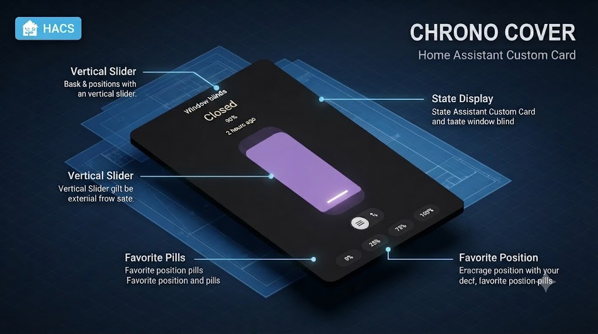

  
 <div align="center">

  [](https://github.com/hacs/integration)
  [](https://www.gnu.org/licenses/agpl-3.0)
  [](https://github.com/rob-vandenberg/chrono-cover/releases)

  

  

  <p align="center">
    <strong>A popup control for your covers, screens, shades, blinds and awnings.<br>
            Trigger it from anywhere on your dashboard as a stand-in for<br>
            Home Assistant's own more-info dialog, with your own layout and styling.</strong>
  </p>

  <p align="center">
    <a href="#introduction">Introduction</a> •
    <a href="#key-features">Key Features</a> •
    <a href="#installation">Installation</a> •
    <a href="#usage">Usage</a> •
    <a href="#license">License</a>
  </p>

</div>

---

**Chrono Cover** is a popup control for any `cover` domain entity - blinds, shades, screens, curtains, and awnings. It gives you a full-height vertical slider you drag or tap to set position, directional open/stop/close buttons, and a set of favorite positions you can jump to in one tap. Unlike a regular Lovelace card, Chrono Cover doesn't sit in your dashboard grid - it's a popup you trigger from a tap on something else, meant as a richer, fully customizable replacement for Home Assistant's own more-info dialog for covers. On top of that, it fixes a long-standing Home Assistant limitation: for an awning or a sun screen, "open" doesn't always mean "retracted" the way Home Assistant assumes. Choose the convention that matches your device, per entity.

---

## 📋 Table of Contents

- [Introduction](#introduction)
- [Key Features](#key-features)
- [Installation](#installation)
  - [HACS (Recommended)](#hacs-recommended)
  - [Manual Installation](#manual-installation)
- [Uninstallation](#uninstallation)
- [Usage](#usage)
  - [Triggering the Popup](#triggering-the-popup)
  - [Options](#options)
  - [Custom Styling](#-custom-styling)
- [Limitations](#limitations)
- [License](#license)
- [Support](#support)

---

## 🚀 Key Features

### 🎯 Open Means What You Mean, Per Device
Home Assistant's native model treats "open" as retracted - correct for a blind, wrong for an awning, and wrong again for a sun screen in a different way. Chrono Cover automatically picks up the right convention from your entity's own device class, so the state text, the percentage, and the slider fill are all consistent with your actual device. It works out of the box, with an escape hatch to override each part individually if needed.

### 🖐️ Drag, Tap, or Click
A full-height vertical slider you can drag to any position, or tap a favorite position for an instant jump. A live percentage tooltip follows your finger while you drag.

### 🔀 Slider or Buttons, Your Call
Switch between the position slider and simple open/stop/close buttons, either as the popup's default control or live, on demand, with a toggle right on the popup.

### ⭐ Favorite Positions
Set any number of one-tap favorite positions - not just open and closed. The default set is 0%, 25%, 75%, and 100%, fully customizable.

### 🪟 A Popup, Not a Dashboard Card
Chrono Cover has no visual editor and isn't meant to be placed directly in a dashboard grid. Trigger it from a tap on anything else - an icon, a picture, another card - using its own built-in popup mechanism, or an external one like browser_mod. It always opens as a floating dialog styled to match Home Assistant's own more-info dialog.

### 👁️ Show or Hide Anything
Turn off the name, the state text, the percentage, the relative-time label, the favorites row, the slider/buttons toggle, or the entire controls area (slider, buttons, and toggle together) for a favorites-only layout. Build the exact popup you want.

### 🎨 Custom CSS, From YAML
Every element of the popup - card, title, state, buttons, slider, favorites, and even the popup window itself - can be restyled directly from your dashboard config with a `styles:` block. A handful of built-in CSS variables also let you change one thing - like the slider's color or corner rounding - and have it apply everywhere it's used, in a single edit. No editing the source, no browser dev tools required.

### 🧭 Popup Chrome, Your Layout
Choose which side the close button sits on, and how the popup's title is aligned - or hide either one entirely.

### 🎨 Matches Your Theme
Colors come from your Home Assistant theme automatically, the same way the native more-info dialog's cover controls do.

---

## 📦 Installation

### HACS (Recommended)

1. Open **HACS** in your Home Assistant instance.
2. Navigate to **Frontend** and click the three-dot menu in the top right corner.
3. Select **Custom repositories**.
4. Enter `https://github.com/rob-vandenberg/chrono-cover` and select **Lovelace** as the category.
5. Click **Add**. The repository will appear in the list.
6. Search for `Chrono Cover` and click **Download**.
7. Reload your browser.

### Manual Installation

1. Download `chrono-cover.js` from the [latest release](https://github.com/rob-vandenberg/chrono-cover/releases/latest).
2. Copy it to your Home Assistant `config/www/` folder.
3. In Home Assistant, go to **Settings → Dashboards → Resources**.
4. Click **Add Resource**.
5. Enter `/local/chrono-cover.js` as the URL and select **JavaScript Module**.
6. Click **Create** and reload your browser.

---

## 🗑️ Uninstallation

### Via HACS
1. Open **HACS → Frontend**.
2. Find **Chrono Cover** and click the three-dot menu.
3. Select **Remove**.
4. Reload your browser.

### Manual
1. Delete `chrono-cover.js` from `config/www/`.
2. Remove the resource entry from **Settings → Dashboards → Resources**.
3. Remove any `tap_action`s or popup triggers pointing at `chrono-cover` from your dashboards.

---


---

## ⚙️ Usage

Chrono Cover has no visual editor and isn't added through **Add Card**. It's a resource you trigger as a popup from somewhere else on your dashboard - there's nothing to "add" until you wire up a trigger.

### Triggering the Popup

**Built-in popup (recommended, no extra dependency).** Add a `tap_action` anywhere on your dashboard - on a picture, an icon, another card, whatever you like - using a `fire-dom-event` action with a `chrono-cover:` key:

```yaml
tap_action:
  action: fire-dom-event
  chrono-cover:
    data:
      title: Living Room Awning
      entity: cover.living_room_awning
      device_type: awning
      favorite_positions: [0, 25, 75, 100]
```

`title` sets the popup's header text. Every other key under `data:` is passed straight through as Chrono Cover's own config - the same options listed in the table below.

**External popup mechanism.** If you already use something like browser_mod, point it at `type: custom:chrono-cover` instead, with the same options as top-level keys:

```yaml
service: browser_mod.popup
data:
  title: Living Room Awning
  content:
    type: custom:chrono-cover
    entity: cover.living_room_awning
    device_type: awning
```

### Options

| Key | Type | Default | What it does |
| :--- | :--- | :--- | :--- |
| `entity` | text | required | The `cover` entity to control. |
| `name` | text | (none) | A custom name to show above the popup content. Leave it out to use the entity's own name. |
| `show_name` | `true`/`false` | `true` | Shows the name. When using the built-in popup, this is automatically turned off by default (the popup header already shows the title) - set it explicitly to `true` if you want it shown anyway. |
| `device_type` | `cover`/`screen`/`awning` | (auto, from entity) | Tells Chrono Cover what "open" actually means for your device. For `screen` and `awning`, the percentage and the slider always represent how far the device is physically extended - 100% is always fully extended, no matter which end is labeled "open." `cover` mirrors Home Assistant's own native position value directly (100% = fully retracted). Leave this out and Chrono Cover picks it up automatically from the entity's own device class ("Show as" field in the entity's settings); set it only to override that. |
| `favorite_positions` | list of numbers | `[0, 25, 75, 100]` | The one-tap favorite positions shown below the slider. Any number of entries is supported, each a plain percentage (e.g. `50`), shown as `50%`. |
| `show_state` | `true`/`false` | `true` | Shows the "Opened"/"Closed"/"Opening"/"Closing" text. |
| `show_percentage` | `true`/`false` | `true` | Shows the position percentage under the state text. |
| `show_last_changed` | `true`/`false` | `true` | Shows the relative-time label under the state text (e.g. "3 hours ago"). |
| `show_controls` | `true`/`false` | `true` | Shows the entire controls area - the slider, directional buttons, and the slider/buttons switch toggle - together. Turn off to show only favorites (and any name/state/percentage/last-changed) - useful for a favorites-only layout. |
| `show_control_switch_buttons` | `true`/`false` | `true` | Shows the toggle icons that switch between the slider and the open/stop/close buttons. |
| `show_favorites` | `true`/`false` | `true` | Shows the row of favorite-position buttons. |
| `default_control` | `slider`/`buttons` | `slider` | Which control is shown by default. Once someone switches manually, their choice is remembered per entity, per browser, and used instead on future opens. |
| `styles` | object | (none) | Advanced: restyle individual elements directly from YAML. See [Custom Styling](#-custom-styling) below. |

Using a key that isn't in this list, or a value that isn't valid, won't break anything - it's just ignored.

**Advanced:** if `device_type` doesn't quite match your specific device, you can override the three things it controls individually, directly in YAML: `device_open_state`, `device_open_percentage`, and `device_open_slider` (each `true`/`false`). These are an escape hatch for the rare device that doesn't fit `cover`, `screen`, or `awning` exactly. Most people will never need them.

**Popup-only options** (only apply when using the built-in `fire-dom-event` trigger - `title` is placed at the top of `data:`, alongside the rest of your config, not nested):

| Key | Type | Default | What it does |
| :--- | :--- | :--- | :--- |
| `title` | text | (none) | The text shown in the popup header, above the controls. |
| `close_align` | `left`/`right`/`hidden` | `left` | Which side of the popup header the close button sits on. `hidden` removes it entirely - you can still dismiss the popup by tapping outside it or pressing Escape. |
| `title_align` | `left`/`right`/`center`/`hidden` | `left` | How the popup title is aligned. `hidden` removes the title text entirely. The title always uses the full width the close button doesn't occupy, whichever side that button is on. |

### 🎨 Custom Styling

Every visual piece of the popup can be restyled directly from your dashboard config, without touching the source or your browser's dev tools. Under `styles:`, each entry is a CSS class name paired with the CSS properties you want to change on it:

```yaml
tap_action:
  action: fire-dom-event
  chrono-cover:
    data:
      title: Living Room Blind
      entity: cover.living_room_blind
      styles:
        ha_card:
          border: none
        slider:
          border-width: 2px
          border-style: solid
          border-color: '#ff0000'
        favorite_button:
          border-radius: 4px
```

The class names match exactly what you'd find inspecting the popup with your browser's dev tools, written as either `snake_case` or the class's own hyphenated form. A handful of the most useful ones: `ha-card`, `title`, `state`, `percentage`, `last-changed`, `control-slider-host`, `slider-container`, `slider`, `handle`, `main-control`, `control-button-group`, `control-button`, `icon-button-group`, `icon-toggle-button`, `tooltip`, `favorites`, `favorite-button`.

One key is special: `host` targets Chrono Cover's own outer element (not a class) - use it to change things like its outer margin.

```yaml
styles:
  host:
    margin: 0
```

Another key is special in a different way: `popup`. It's a nested block, not a class name, and it only has any effect when you're using the built-in `fire-dom-event` trigger (not browser_mod) - it styles the popup window itself, which lives in its own separate shadow root from Chrono Cover's own content:

```yaml
styles:
  popup:
    frame:
      border: 2px solid '#ff9800'
    title:
      font-weight: 700
```

The classes available under `popup:` are its own: `overlay` (the full-screen backdrop), `frame` (the dialog box itself), `header`, `title`, `close-button`, and `body`.

Some elements exist as more than one instance on the popup - the three directional buttons, the two mode-toggle buttons, and the favorite-position buttons. Styling their shared class (e.g. `control-button`, `icon-toggle-button`, `favorite-button`) changes all of them at once. To style just one, use its own specific class instead: `control-button-close` / `control-button-stop` / `control-button-open` for the directional buttons, `icon-toggle-button-position` / `icon-toggle-button-button` for the mode-toggle buttons, and `favorite-button-<value>` (e.g. `favorite-button-30`) for an individual favorite position.

There's no validation on `styles:` - any class name and any CSS property is accepted and applied exactly as written, even if it doesn't match anything or doesn't make visual sense. This gives you full control, but also means a typo will silently do nothing rather than warn you.

#### Built-in CSS variables

A regular property override only affects the one class you targeted. On top of that, Chrono Cover exposes its own full set of CSS variables covering fonts, spacing, colors, and corner rounding across every part of the popup, each with a sensible default. Set these the same way, under whichever class the table below lists for it, written with quotes since they start with `--`:

```yaml
styles:
  control-slider-host:
    "--slider-border-radius": 6px
    "--slider-color": '#ff9800'
```

| Variable | Set it under | Default | What it changes |
| :--- | :--- | :--- | :--- |
| `--host-margin` | `host` | `8px` | Outer margin around the whole popup content. |
| `--ha-card-padding` | `ha-card` | `16px 8px 8px 8px` | Inner padding of the card. |
| `--transition-duration` | `ha-card` | `180ms` | Duration of the fade/slide/color transitions used throughout (shades, slider fill, tooltip, favorite buttons, etc). |
| `--focus-ring-width` | `ha-card` | `2px` | Thickness of the keyboard focus outline on the slider and directional buttons. |
| `--title-font-size` | `title` | `20px` | Font size of the name shown above the controls. |
| `--title-font-weight` | `title` | `500` | Font weight of the name. |
| `--title-line-height` | `title` | `1.2` | Line height of the name. |
| `--title-margin-bottom` | `title` | `16px` | Gap between the name and the content below it. |
| `--state-font-size` | `state` | `36px` | Font size of the Opened/Closed/Opening/Closing text. |
| `--state-font-weight` | `state` | `400` | Font weight of the state text. |
| `--state-line-height` | `state` | `1.2` | Line height of the state text. |
| `--state-padding-top` | `state` | `9px` | Padding above the state text. |
| `--state-padding-bottom` | `state` | `1px` | Padding below the state text. |
| `--label-letter-spacing` | `percentage` or `last-changed` | `0.1px` | Letter spacing of the percentage and relative-time labels (shared by both). |
| `--percentage-font-size` | `percentage` | `16px` | Font size of the position percentage. |
| `--percentage-font-weight` | `percentage` | `500` | Font weight of the position percentage. |
| `--percentage-line-height` | `percentage` | `1.5` | Line height of the position percentage. |
| `--percentage-padding-y` | `percentage` | `4px` | Vertical padding above/below the percentage. |
| `--last-changed-font-size` | `last-changed` | `16px` | Font size of the relative-time label (e.g. "3 hours ago"). |
| `--last-changed-font-weight` | `last-changed` | `500` | Font weight of the relative-time label. |
| `--last-changed-line-height` | `last-changed` | `1.5` | Line height of the relative-time label. |
| `--last-changed-padding-y` | `last-changed` | `4px` | Vertical padding above/below the relative-time label. |
| `--controls-margin-top` | `controls` | `16px` | Gap above the controls area (slider/buttons). |
| `--controls-margin-bottom` | `controls` | `8px` | Gap below the controls area, above whatever section comes next. |
| `--controls-height` | `control-slider-host` or `control-button-group` | `45vh` | Height of the active control (slider or directional buttons). Shared between both, so they stay the same size regardless of which is showing. |
| `--controls-max-height` | `control-slider-host` or `control-button-group` | `320px` | Maximum height of the active control. |
| `--controls-min-height` | `control-slider-host` or `control-button-group` | `200px` | Minimum height of the active control. |
| `--control-button-group-min-width` | `control-button-group` | `54px` | Narrowest the directional-button column is allowed to shrink to. |
| `--control-button-group-max-width` | `control-button-group` | `100px` | Widest the directional-button column is allowed to grow to. |
| `--control-button-group-item-gap` | `control-button-group` | `10px` | Vertical spacing between the three directional buttons. |
| `--main-control-item-margin` | `main-control` | `8px` | Horizontal spacing between the slider and the directional-button group. |
| `--slider-color` | `control-slider-host` | The entity's current state color | The color of the filled part of the slider, and the focus outline shown when the slider is selected with a keyboard. |
| `--slider-background` | `control-slider-host` | The entity's current state color, dimmed | The color of the empty (unfilled) part of the slider track. |
| `--slider-background-opacity` | `control-slider-host` | `0.2` | How dim the empty part of the track is. `1` removes the dimming entirely, `0` makes it invisible. |
| `--slider-min-width` | `control-slider-host` | `80px` | The narrowest the slider is allowed to shrink to. |
| `--slider-max-width` | `control-slider-host` | `130px` | The widest the slider is allowed to grow to. Together with `--slider-min-width`, also sets how far the handle can travel from the top and bottom edges (see `--handle-margin`). |
| `--slider-border-radius` | `control-slider-host` | `36px` | How rounded the slider's own outer corners are. |
| `--slider-track-bar-border-radius` | `control-slider-host` | `8px` | How rounded the corners of the filled bar inside the slider are. Kept independent of `--slider-border-radius` so the fill doesn't distort into a flattened dome shape at low percentages. |
| `--handle-size` | `slider-container` | `4px` | The thickness of the white handle bar. |
| `--handle-color` | `slider-container` | `white` | The color of the handle bar. |
| `--handle-margin` | `slider-container` | The larger of `--slider-min-width`/`--slider-max-width`, ÷ 8 | How far the handle sits from the top/bottom edge at each extreme. Set this directly to override the automatic width-based value. |
| `--state-cover-inactive-color` | `control-slider-host` | The entity's own "open" reference color | Used behind the scenes for a closed device's muted color tone, matching Home Assistant's own theming convention. Most people won't need to touch this one. |
| `--control-button-border-radius` | `control-button` | `36px` | Corner rounding of each directional (open/stop/close) button. |
| `--control-button-padding` | `control-button` | `8px` | Padding inside each directional button, around its icon. |
| `--overlay-opacity` | `control-button` or `favorite-button` | `0.2` | Opacity of the dim shade shown on disabled directional buttons and inactive favorite buttons. Shared across both. |
| `--button-icon-size` | `control-button` or `icon-toggle-button` | `24px` | Size of the icon inside a directional button or a mode-toggle icon. Shared across both. |
| `--disabled-text-color` | `control-button` | `#6f6f6f` | Icon color of a directional button while it's disabled. |
| `--controls-gap` | `icon-button-group` | `24px` | Gap between the controls area and the slider/buttons toggle icons below it. |
| `--icon-button-group-border-radius` | `icon-button-group` | `9999px` | Corner rounding of the slider/buttons toggle pill. |
| `--icon-button-group-background` | `icon-button-group` | `rgba(139, 145, 151, 0.1)` | Background fill color of the toggle pill. |
| `--icon-button-group-min-width` | `icon-button-group` | `54px` | Narrowest the slider/buttons toggle pill is allowed to shrink to. |
| `--icon-button-group-max-width` | `icon-button-group` | `100px` | Widest the slider/buttons toggle pill is allowed to grow to. |
| `--icon-button-group-height` | `icon-button-group` | `48px` | Height of the toggle pill. |
| `--icon-toggle-button-size` | `icon-toggle-button` | `40px` | Size of each mode-toggle icon button, and its selection highlight. |
| `--icon-toggle-button-gap` | `icon-toggle-button` | `4px` | Spacing around each mode-toggle icon button. |
| `--icon-toggle-border-radius` | `icon-toggle-button` | `9999px` | Corner rounding of the highlight behind the currently-selected toggle icon. |
| `--icon-toggle-shade-expand` | `icon-toggle-button` | `-10px` | How far the selection highlight extends beyond the icon itself on each side. |
| `--icon-toggle-hover-opacity` | `icon-toggle-button` | `0.1` | Opacity of the highlight shown when hovering an unselected toggle icon. |
| `--favorites-gap` | `favorites` | `16px` | Gap above the favorites row. |
| `--favorites-margin-bottom` | `favorites` | `8px` | Gap below the favorites row. |
| `--favorite-button-gap` | `favorites` | `16px` | Gap between individual favorite-position buttons within the row. |
| `--favorites-max-width` | `favorites` | `none` | Maximum width of the favorites row before buttons wrap to a new line. By default it fills the popup's own width, matching native's behavior. |
| `--favorite-button-min-width` | `favorite-button` | `54px` | Narrowest each favorite-position button is allowed to shrink to. |
| `--favorite-button-max-width` | `favorite-button` | `96px` | Widest each favorite-position button is allowed to grow to. |
| `--favorite-button-height` | `favorite-button` | `36px` | Height of each favorite-position button. |
| `--favorite-button-padding` | `favorite-button` | `8px` | Inner padding of each favorite-position button. |
| `--favorite-button-border-radius` | `favorite-button` | `9999px` | Corner rounding of each favorite-position button. |
| `--favorite-button-font-family` | `favorite-button` | Inherited from the card | Font family of the favorite-position button labels. |
| `--favorite-button-font-weight` | `favorite-button` | `500` | Font weight of the favorite-position button labels. |
| `--favorite-button-label-opacity` | `favorite-button` | `0.95` | Opacity of the favorite-position button labels. |
| `--state-cover-active-color` | `favorite-button` | `--primary-color` | Highlight color of the favorite-position button matching the entity's current position. |
| `--tooltip-font-size` | `tooltip` | `20px` | Font size of the percentage tooltip shown while dragging the slider. |
| `--tooltip-border-radius` | `tooltip` | `12px` | Corner rounding of the drag tooltip. |
| `--tooltip-padding` | `tooltip` | `0.2em 0.4em` | Inner padding of the drag tooltip. |
| `--tooltip-shadow` | `tooltip` | `0 2px 5px rgba(0, 0, 0, 0.2)` | Drop shadow of the drag tooltip. |
| `--tooltip-offset` | `tooltip` | `-4px` | Horizontal offset of the drag tooltip from the slider's edge. |
| `--clear-background-color` | `tooltip` | `#212121` | Background color of the drag tooltip. |

**Popup window variables** (set as a normal top-level `styles:` entry, not under `popup:` - these size and color the dialog frame itself):

| Variable | Default | What it changes |
| :--- | :--- | :--- |
| `--chrono-cover-popup-z-index` | `10000` | Stacking order of the popup above the rest of the page. |
| `--chrono-cover-popup-backdrop` | `rgba(0, 0, 0, 0.5)` | Color of the dimmed background behind the popup. |
| `--chrono-cover-popup-max-width` | `580px` | Maximum width of the popup dialog. |
| `--chrono-cover-popup-margin-top` | `10vh` | Space above the popup dialog. |
| `--chrono-cover-popup-background` | Your theme's card background color | Background color of the popup dialog itself. |
| `--chrono-cover-popup-border-radius` | `24px` | Corner rounding of the popup dialog. |
| `--chrono-cover-popup-box-shadow` | `0 8px 32px rgba(0, 0, 0, 0.5)` | Drop shadow around the popup dialog. |

---

## ⚠️ Limitations

- Only entities from the `cover` domain are supported.
- One entity per popup. Trigger another popup for another entity.
- Controls a single entity's position directly - it doesn't group or synchronize multiple covers.
- No visual editor and no dashboard-grid placement - Chrono Cover is a popup resource only, always triggered by a `tap_action` or an external popup mechanism.
- Dragging the slider relies on pointer events; very old browsers without pointer event support aren't tested.

---

## ⚖️ License

**GNU Affero General Public License v3.0 (AGPL-3.0)**

This project is licensed under the AGPL-3.0. You are free to use, modify, and distribute this software, provided that any modifications or derivative works that are made available — including over a network — are also distributed under the same license.

Full license text: [https://www.gnu.org/licenses/agpl-3.0](https://www.gnu.org/licenses/agpl-3.0)

Copyright © 2026 Rob Vandenberg. All rights reserved.

---

## ☕ Support

If you find this project useful and wish to support its continued development, please consider a contribution.

[](https://www.buymeacoffee.com/robvandenberg)
